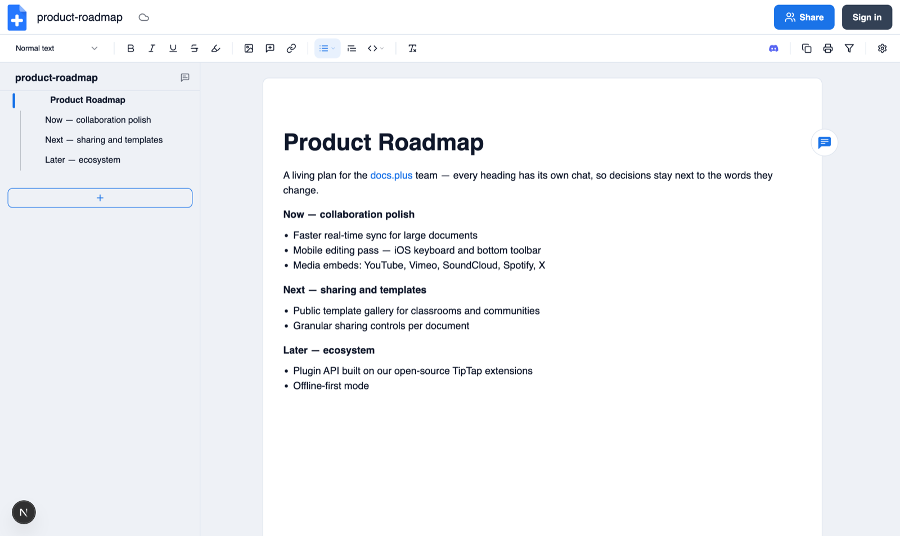

# 📚 docs.plus

[](https://github.com/docs-plus/docs.plus/releases)
[](LICENSE)
[](https://github.com/docs-plus/docs.plus/pulls)
[](https://discord.com/invite/25JPG38J59)
[](https://supabase.com)
[](https://bun.sh)

<a href="https://docs.plus">
  <picture>
    <source media="(prefers-color-scheme: dark)" srcset=".github/assets/editor-dark.png" />
    
  </picture>
</a>

docs.plus is a free, real-time collaboration tool built on open-source technologies. It empowers communities to share and organize information logically and hierarchically, making teamwork and knowledge sharing straightforward and effective.

**[Try it live at docs.plus →](https://docs.plus)**

**Tech Stack:**

- **Runtime**: 🚀 Bun 1.3.7+
- **Frontend**: ⚛️ Next.js 15/16, React 19, TipTap 3, Tailwind CSS 4
- **Backend**: 🔧 Hono, Hocuspocus (Y.js), BullMQ, Prisma ORM
- **Database**: 🐘 PostgreSQL 17, 🔴 Redis
- **Infrastructure**: 🐳 Docker Compose, Supabase
- **Real-time**: 🔌 WebSocket (Hocuspocus), Supabase Realtime

## 📋 Prerequisites

- 🐳 **Docker** & **Docker Compose** v2+ - [Install](https://docs.docker.com/get-docker/)
  - ⚠️ **macOS Silicon users:** Docker Desktop has IO performance issues. Use [OrbStack](https://orbstack.dev/) instead (drop-in replacement, faster, lighter).
- 🚀 **Bun** >=1.3.7 - [Install](https://bun.sh/docs/installation)
- 📦 **Node.js** >=24.11 - [Install](https://nodejs.org/) (Next.js and tooling binaries run on Node)
- 🪟 **Windows:** use WSL2 — the dev workflow relies on `make` and `bash`

No global Supabase CLI needed — the repo pins it as a workspace dependency.

## 🚀 Quick Start

```bash
git clone https://github.com/docs-plus/docs.plus.git
cd docs.plus
make dev-local
```

One command bootstraps everything: env files from `.env.example`, dependencies, Postgres + Redis containers, local Supabase (schema and seed apply automatically), Prisma migrations, editor-extension builds — then starts the REST API, WebSocket server, worker, and webapp. The first run downloads Docker images and takes several minutes; after that it starts in seconds.

**URLs:** webapp <http://localhost:3000> · API <http://localhost:4000> · WS `ws://localhost:4001` · Supabase Studio <http://127.0.0.1:54323> · local email inbox <http://127.0.0.1:54324>

**Sign-in:** any email/password works locally (auto-confirmed, no real email sent). Google sign-in needs `GOOGLE_CLIENT_ID`/`GOOGLE_SECRET` in `.env.local`.

**Stop:** `Ctrl+C` stops the app processes · `make infra-down` stops Postgres/Redis · `bun --filter @docs.plus/supabase_back stop` stops Supabase

**Reset the local database:** `bun --filter @docs.plus/supabase_back reset`

<details>
<summary><strong>🐳 Alternative: full Docker (`make up-dev`)</strong></summary>

All services in containers instead of native processes:

```bash
cp .env.example .env.development
make up-dev
```

**URLs:** webapp <http://localhost:3000> · API <http://localhost:4000> · WS `ws://localhost:4001` · Studio <http://127.0.0.1:54323>

</details>

<details>
<summary><strong>☁️ Alternative: Supabase Cloud instead of local Supabase</strong></summary>

Use a hosted Supabase project instead of the local stack:

**Step 1: Create a Supabase project** 🚀

1. Go to the [Supabase Dashboard](https://supabase.com/dashboard)
2. Create a new project
3. Copy your project URL and keys from **Settings → API**

**Step 2: Update environment variables** ⚙️

Update `.env.development` (and the generated `.env.local`) with your cloud project credentials:

```bash
# Server-side (containers → Supabase Cloud)
SUPABASE_URL=https://your-project.supabase.co
SUPABASE_ANON_KEY=your-anon-key-here
SUPABASE_SERVICE_ROLE_KEY=your-service-role-key

# Client-side (browser → Supabase Cloud)
NEXT_PUBLIC_SUPABASE_URL=https://your-project.supabase.co
NEXT_PUBLIC_SUPABASE_WS_URL=wss://your-project.supabase.co
NEXT_PUBLIC_SUPABASE_ANON_KEY=your-anon-key-here
```

**Step 3: Apply schema and extensions** 📊

- Activate **pg_cron** and **pgmq (Queues)** in the Dashboard's Integrations page
- Run the SQL from `packages/supabase/scripts/` in numbered order via the SQL Editor (`00-bootstrap.sql` first — it creates the extensions and the `internal` schema the later scripts depend on)

**Step 4: Configure push notifications (optional)** 🔔

```env
VAPID_PUBLIC_KEY=your-vapid-public-key
VAPID_PRIVATE_KEY=your-vapid-private-key
VAPID_SUBJECT=mailto:support@yourdomain.com
```

Generate VAPID keys: `bunx web-push generate-vapid-keys`. Architecture notes: `packages/supabase/scripts/07-4-push-notifications-pgmq.sql`.

**Step 5: Configure OAuth redirect URLs** 🔐

Go to **Authentication → URL Configuration** in the Supabase Dashboard and add your **Redirect URLs**:

```
https://yourdomain.com
https://yourdomain.com/*
https://admin.yourdomain.com
https://admin.yourdomain.com/*
```

**Step 6: Add admin users** 👤

Only users in the `admin_users` table can access the admin dashboard:

```sql
INSERT INTO public.admin_users (user_id, created_at)
SELECT id, now() FROM auth.users WHERE email = 'your-admin@example.com';
```

</details>

## ⚙️ Environment Files

| Docker Compose File        | Environment File   | Usage                                            |
| -------------------------- | ------------------ | ------------------------------------------------ |
| `docker-compose.prod.yml`  | `.env.production`  | Production deployment                            |
| `docker-compose.dev.yml`   | `.env.development` | Docker development (all services in containers)  |
| `docker-compose.local.yml` | `.env.local`       | Local development (infra in Docker, apps native) |

`make dev-local` creates both dev files on first run: `.env.development` from `.env.example`, then `.env.local` from it with localhost hostnames and `DATABASE_URL` applied (native apps can't resolve Docker service names). Both are gitignored — edit `.env.local` for local customizations like Google OAuth keys. Details live in the comments of [.env.example](.env.example).

## 🚀 Production Deployment

Production-ready setup for **mid-level scale deployments** (small-medium teams, moderate traffic).

**Architecture:** 🏗️

- 📈 Horizontal scaling: REST API (2), WebSocket (2), Worker (2), Webapp (2)
- 🔀 Traefik v3 reverse proxy with automatic SSL (Let's Encrypt) and load balancing
- ⚡ Resource limits, health checks, and zero-downtime blue-green deploys
- 📊 Production-optimized logging and connection pooling

### Setup

1. **⚙️ Configure Environment**

   ```bash
   cp .env.example .env.production
   ```

   Update: database credentials, JWT secret, Supabase URLs, storage credentials, CORS origins.

2. **🔨 Build & Deploy**

   ```bash
   make build
   make up-prod
   ```

3. **📈 Scaling**
   Adjust replicas in `.env.production`:

   ```bash
   REST_REPLICAS=2
   WS_REPLICAS=3
   WORKER_REPLICAS=2
   WEBAPP_REPLICAS=2
   ```

**Production Recommendations:** 💡

- 🗄️ Use managed database (AWS RDS, DigitalOcean, Supabase Cloud)
- 🔒 Configure SSL/TLS certificates
- 📊 Set up monitoring (Prometheus, Grafana)
- 💾 Implement database backups
- 🔐 Secure all secrets and credentials

## 📖 Command Reference

```bash
# Running (local apps on host)
make dev-local         # Full local stack (bootstraps everything)
make dev-backend       # Backend only
make infra-up          # Start Postgres + Redis only
make infra-down        # Stop Postgres + Redis
bun --filter @docs.plus/supabase_back stop   # Stop Supabase

# Running (all services in Docker)
make up-dev            # Development
make up-prod           # Production

# Building
make build             # Production images
make build-dev         # Development images

# Other Bun entrypoints
bun run dev                                          # Webapp only
bun run dev:admin                                    # Admin dashboard

# Management
make down              # Stop services (auto-detects env)
make logs              # All logs (auto-detects env)
make ps                # Container status
make clean             # Cleanup + delete volumes (DATA LOSS)
```

Run `make help` for the complete Make surface; `bun run` (no args) for all root scripts.

## 🔌 TipTap extensions

Five open-source [Tiptap](https://tiptap.dev) extensions power the docs.plus editor. Each ships on npm under `@docs.plus`:

```sh
bun add @docs.plus/extension-hyperlink
```

| Package                                                              | Description                                                            |
| -------------------------------------------------------------------- | ---------------------------------------------------------------------- |
| [`extension-hyperlink`](extensions/extension-hyperlink/)             | Hyperlink mark, autolink, popovers, URL safety                         |
| [`extension-hypermultimedia`](extensions/extension-hypermultimedia/) | Images, audio, video, and embeds (YouTube, Vimeo, SoundCloud, Loom, X) |
| [`extension-indent`](extensions/extension-indent/)                   | Tab / Shift-Tab literal indent with context allowlist                  |
| [`extension-inline-code`](extensions/extension-inline-code/)         | Inline code mark (`Mod-e`, backtick rules)                             |
| [`extension-placeholder`](extensions/extension-placeholder/)         | O(1) cursor-based empty-node placeholder                               |

Install notes, recommended pairings, and contributing: [extensions/README.md](extensions/README.md). Release policy: [RELEASE_POLICY.md](RELEASE_POLICY.md).

## 📁 Project Structure

```
docs.plus/
├── apps/
│   ├── webapp/              # 🌐 Next.js frontend
│   ├── hocuspocus.server/   # ⚡ REST API, WebSocket, Workers
│   └── admin-dashboard/     # 🖥️ Admin panel
├── extensions/
│   └── extension-*/         # 🔌 Five publishable @docs.plus TipTap packages
├── packages/
│   └── supabase/            # 🗄️ Database schema, seed, migrations
├── docker-compose.dev.yml   # 🐳 Development orchestration
├── docker-compose.prod.yml  # 🚀 Production orchestration
├── Makefile                 # 🛠️ Build & deployment commands
└── .env.example             # ⚙️ Environment template
```

## 🤝 Contributing

PRs welcome! See [contributing guidelines](CONTRIBUTING.md) for details.

**First contribution? Start here:**

- Pick an issue labeled [good first issue](https://github.com/docs-plus/docs.plus/issues?q=is%3Aissue%20is%3Aopen%20label%3A%22good%20first%20issue%22) or [help wanted](https://github.com/docs-plus/docs.plus/issues?q=is%3Aissue%20is%3Aopen%20label%3A%22help%20wanted%22).
- Confirm your setup with `bun run check` before opening a PR.
- Use our issue and PR templates to speed up review.

## 🎨 Badges

Using docs.plus? Add a badge to your README and link back.

### Variants

| Style         | Preview                                                                 | File                               |
| ------------- | ----------------------------------------------------------------------- | ---------------------------------- |
| Default       |                | `badge-docsplus.svg`               |
| Light         |          | `badge-docsplus-light.svg`         |
| Dark          |           | `badge-docsplus-dark.svg`          |
| Flat-square   |    | `badge-docsplus-flat-square.svg`   |
| For-the-badge |  | `badge-docsplus-for-the-badge.svg` |

### Usage

**Markdown:**

```markdown
[](https://docs.plus)
```

**HTML** — auto light/dark switching for GitHub READMEs:

```html
<a href="https://docs.plus">
  <picture>
    <source
      media="(prefers-color-scheme: dark)"
      srcset="https://docs.plus/badges/badge-docsplus-dark.svg" />
    
  </picture>
</a>
```

Swap the filename for any variant in the table above.

## 📄 License

MIT License - See [LICENSE](LICENSE)

## 💬 Support

- 💬 **Discord**: [Join our server](https://discord.com/invite/25JPG38J59)
- 🐦 **Twitter**: [@docsdotplus](https://twitter.com/docsdotplus)
- 🐙 **GitHub**: [docs.plus](https://github.com/docs-plus/docs.plus)
- 📧 **Email**: [contact@newspeak.house](mailto:contact@newspeak.house)

---

<a href="https://patreon.com/docsplus"></a>
