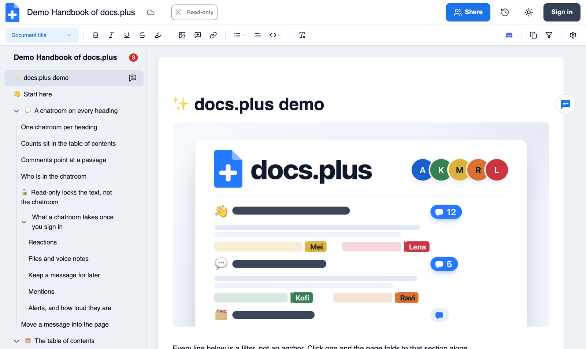

# 📚 docs.plus

docs.plus is a free, open-source tool for real-time collaborative documents. Every heading in a document has its own chatroom, so a discussion stays next to the section it is about. The table of contents shows who is in each chatroom and how many messages you have not read.

[](https://www.npmjs.com/search?q=keywords:docs.plus)
[](LICENSE)
[](https://github.com/docs-plus/docs.plus/pulls)
[](https://discord.com/invite/25JPG38J59)
[](https://supabase.com)
[](https://bun.sh)

<a href="https://docs.plus">
  <picture>
    <source media="(prefers-color-scheme: dark)" srcset=".github/assets/editor-dark.png" />
    
  </picture>
</a>

**[Try it live at docs.plus →](https://docs.plus)**

**Tech Stack:**

- **Runtime**: 🚀 Bun 1.3.7+
- **Frontend**: ⚛️ Next.js (`apps/webapp` on `15.5.21`, `apps/admin-dashboard` on `^16.2.12`), React 19, Tiptap 3, Tailwind CSS 4
- **Backend**: 🔧 Hono, Hocuspocus (Yjs), BullMQ, Prisma ORM
- **Database**: 🐘 PostgreSQL 17 for the Prisma database in local and dev, 🐘 PostgreSQL 15 for local Supabase, 🔴 Redis
- **Infrastructure**: 🐳 Docker Compose, Supabase
- **Real-time**: 🔌 WebSocket (Hocuspocus), Supabase Realtime

## 📋 Prerequisites

- 🐳 **Docker** & **Docker Compose** v2+ - [Install](https://docs.docker.com/get-docker/)
  - ⚠️ **macOS Silicon users:** Docker Desktop has IO performance issues. Use [OrbStack](https://orbstack.dev/) instead (drop-in replacement, faster, lighter).
- 🚀 **Bun** >=1.3.7 - [Install](https://bun.sh/docs/installation)
- 📦 **Node.js** >=24.11.0 - [Install](https://nodejs.org/) (Next.js and tooling binaries run on Node)
- 🔨 **GNU Make** - every command below starts with `make`. macOS installs it with `xcode-select --install`; most Linux distributions ship it in a build-tools package.
- 🌱 **Git** - [Install](https://git-scm.com/downloads)
- 🪟 **Windows:** use WSL2 — the dev workflow relies on `make` and `bash`
- 🚫 **Bun only:** never run npm, yarn, pnpm or npx in this repo. `bun.lock` is the only lockfile. Never commit `package-lock.json`, `yarn.lock` or `pnpm-lock.yaml`.

No global Supabase CLI needed — the repo pins it as a workspace dependency.

## 🚀 Quick Start

```bash
git clone https://github.com/docs-plus/docs.plus.git
cd docs.plus
make dev-local
```

One command bootstraps everything: env files from `.env.example`, dependencies, Postgres + Redis containers, local Supabase (schema and seed apply automatically), Prisma migrations, editor-extension builds. It then starts the REST API, WebSocket server, worker, and webapp. The first run downloads Docker images and takes several minutes. Later runs start in seconds.

If the first run stops, see [Development Setup](CONTRIBUTING.md#-development-setup) in the contributing guide. It owns the environment health check and what to do when a check fails.

**URLs:** webapp <http://localhost:3000> · API <http://localhost:4000> · WS `ws://localhost:4001` · Supabase Studio <http://127.0.0.1:54323> · local email inbox <http://127.0.0.1:54324>

**Sign-in:** any email/password works locally (auto-confirmed, no real email sent). Google sign-in needs `GOOGLE_CLIENT_ID`/`GOOGLE_SECRET` in `.env.local`.

**Stop:** `Ctrl+C` stops the app processes · `make infra-down` stops Postgres/Redis · `bun --filter @docs.plus/supabase_back stop` stops Supabase

**Reset the local Supabase database:** `bun --filter @docs.plus/supabase_back reset`

The local stack runs two databases. That command resets the Supabase database on port 54322 only. The Prisma database `docsplus` runs in the container `docsy-postgres-local` on port 5432, and it survives the reset.

## 📖 Documentation

Full documentation lives in [`docs/`](docs/README.md).

| I want to                      | Read                                                                                  |
| ------------------------------ | ------------------------------------------------------------------------------------- |
| Run docs.plus on my own server | [Self-hosting](docs/self-hosting/README.md) → [Install](docs/self-hosting/install.md) |
| Call the API from my code      | [API overview](docs/api/README.md) → [Quickstart](docs/api/quickstart.md)             |
| Change the code                | [CONTRIBUTING.md](CONTRIBUTING.md)                                                    |
| Understand a past decision     | [Decision records](docs/README.md#decision-records)                                   |

<details>
<summary><strong>🐳 Alternative: full Docker (`make up-dev`)</strong></summary>

All services in containers instead of native processes:

```bash
cp .env.example .env.development
make up-dev
bun --filter @docs.plus/supabase_back start
```

`make up-dev` starts no Supabase. The containers read `SUPABASE_URL: http://host.docker.internal:54321` from the host, so the third command supplies it. That command also opens Supabase Studio at <http://127.0.0.1:54323>.

**URLs:** webapp <http://localhost:3000> · API <http://localhost:4000> · WS `ws://localhost:4001` · Studio <http://127.0.0.1:54323>

</details>

<details>
<summary><strong>☁️ Alternative: Supabase Cloud instead of local Supabase</strong></summary>

Use a hosted Supabase project instead of the local stack:

**Step 1: Create a Supabase project** 🚀

1. Go to the [Supabase Dashboard](https://supabase.com/dashboard)
2. Create a new project
3. Copy your project URL and keys from **Settings → API**

**Step 2: Update environment variables** ⚙️

Update `.env.development` (and the generated `.env.local`) with your cloud project credentials:

```bash
# Server-side (containers → Supabase Cloud)
SUPABASE_URL=https://your-project.supabase.co
SUPABASE_ANON_KEY=your-anon-key-here
SUPABASE_SERVICE_ROLE_KEY=your-service-role-key

# Client-side (browser → Supabase Cloud)
NEXT_PUBLIC_SUPABASE_URL=https://your-project.supabase.co
NEXT_PUBLIC_SUPABASE_WS_URL=wss://your-project.supabase.co
NEXT_PUBLIC_SUPABASE_ANON_KEY=your-anon-key-here
```

**Step 3: Apply schema and extensions** 📊

- Activate **pg_cron** and **pgmq (Queues)** in the Dashboard's Integrations page
- Run the SQL from `packages/supabase/scripts/` in numbered order via the SQL Editor. Run `00-bootstrap.sql` first: it creates the extensions and the `internal` schema the later scripts depend on.

**Step 4: Configure push notifications (optional)** 🔔

```env
VAPID_PUBLIC_KEY=your-vapid-public-key
VAPID_PRIVATE_KEY=your-vapid-private-key
VAPID_SUBJECT=mailto:support@yourdomain.com
```

Generate VAPID keys: `bunx web-push generate-vapid-keys`. Architecture notes: `packages/supabase/scripts/07-4-push-notifications-pgmq.sql`.

**Step 5: Configure OAuth redirect URLs** 🔐

Go to **Authentication → URL Configuration** in the Supabase Dashboard and add your **Redirect URLs**:

```
https://yourdomain.com
https://yourdomain.com/*
https://admin.yourdomain.com
https://admin.yourdomain.com/*
```

**Step 6: Add admin users** 👤

Only users in the `admin_users` table can access the admin dashboard:

```sql
INSERT INTO public.admin_users (user_id, created_at)
SELECT id, now() FROM auth.users WHERE email = 'your-admin@example.com';
```

</details>

## ⚙️ Environment Files

| Docker Compose File        | Environment File   | Usage                                            |
| -------------------------- | ------------------ | ------------------------------------------------ |
| `docker-compose.prod.yml`  | `.env.production`  | Production deployment                            |
| `docker-compose.dev.yml`   | `.env.development` | Docker development (all services in containers)  |
| `docker-compose.local.yml` | `.env.local`       | Local development (infra in Docker, apps native) |

Two more compose files sit outside this table. `make run-prod-backend` layers `docker-compose.backend-local.override.yml` over the production file with `.env.local`. `docker-compose.observability.yml` runs on the production droplet only.

`make dev-local` creates both dev files on first run. It writes `.env.development` from `.env.example`, then `.env.local` from it with localhost hostnames and `DATABASE_URL` applied. Native apps can't resolve Docker service names. Both are gitignored — edit `.env.local` for local customizations like Google OAuth keys. Details live in the comments of [.env.example](.env.example).

## 📖 Command Reference

```bash
# Running (local apps on host)
make dev-local         # Full local stack (bootstraps everything)
make dev-backend       # Backend only
make infra-up          # Start Postgres + Redis only
make infra-down        # Stop Postgres + Redis
bun --filter @docs.plus/supabase_back stop   # Stop Supabase

# Running (all services in Docker)
make up-dev            # Development
make up-prod           # Production

# Building
make build             # Production images
make build-dev         # Development images

# Other Bun entrypoints
bun run dev                                          # Webapp only
bun run dev:admin                                    # Admin dashboard
bun run doctor                                       # Environment health check

# Management
make down              # Stop services (auto-detects env)
make logs              # All logs (auto-detects env)
make ps                # Container status
make clean             # Cleanup + delete volumes (DATA LOSS)
```

`make help` lists the day-to-day surface, not every target. It omits `run-prod-backend`, `observability-up`, `observability-down`, `observability-logs` and `observability-pull`. The four `observability-*` targets run on the production droplet. `run-prod-backend` runs the production backend images locally against `.env.local`. Run `bun run` with no arguments for all root scripts.

## 📁 Project Structure

```
docs.plus/
├── apps/
│   ├── webapp/                  # 🌐 Next.js frontend
│   │   ├── src/
│   │   │   ├── components/      # React components
│   │   │   ├── api/             # API clients
│   │   │   ├── hooks/           # React hooks
│   │   │   ├── stores/          # State management
│   │   │   └── utils/           # Utility functions
│   │   └── cypress/             # E2E tests
│   ├── hocuspocus.server/       # ⚡ REST API, WebSocket, Workers
│   │   ├── src/
│   │   │   ├── api/             # REST API routes & controllers
│   │   │   ├── lib/             # Shared libraries (email, push, etc.)
│   │   │   ├── middleware/      # Hono middleware
│   │   │   └── config/          # Configuration & env schemas
│   │   └── prisma/              # Prisma schema & migrations
│   └── admin-dashboard/         # 🖥️ Admin interface (Next.js)
├── extensions/
│   └── extension-*/             # 🔌 Five publishable @docs.plus Tiptap packages
├── packages/
│   ├── document-swarm/          # 🐝 Multi-user demo and load CLI (Playwright)
│   ├── email-templates/         # ✉️ Email templates and rendering
│   ├── eslint-config/           # 🧹 Shared ESLint configuration
│   ├── floating-popover/        # 🎈 Popover lifecycle engine
│   ├── floating-tooltip/        # 💬 Hover/focus tooltip primitive
│   ├── playground/              # 🧪 Clean-room Cypress harness
│   ├── release-tooling/         # 📦 Shared prepack and publish guards
│   └── supabase/                # 🗄️ Database schema, seed, migrations
├── .github/workflows/           # 🔄 CI/CD pipelines
├── docker-compose.dev.yml       # 🐳 Development orchestration
├── docker-compose.prod.yml      # 🚀 Production orchestration
├── Makefile                     # 🛠️ Build & deployment commands
└── .env.example                 # ⚙️ Environment template
```

Deeper layout lives in `apps/webapp/README.md`, `apps/hocuspocus.server/Readme.md` and each area's `CLAUDE.md`.

## 🔌 Tiptap Extensions

Five open-source [Tiptap](https://tiptap.dev) extensions power the docs.plus editor. The table below describes the source in this repository. All five are published on npm at `2.0.0`. A published version can still lag this source, so check the status tracker before you pin one.

```sh
bun add @docs.plus/extension-hyperlink
```

| Package                                                              | Description                                                                                   |
| -------------------------------------------------------------------- | --------------------------------------------------------------------------------------------- |
| [`extension-hyperlink`](extensions/extension-hyperlink/)             | Hyperlink mark, autolink, optional prebuilt popovers, dangerous-scheme gate                   |
| [`extension-hypermultimedia`](extensions/extension-hypermultimedia/) | Nine media nodes: image, audio, video, YouTube, Vimeo, SoundCloud, Spotify, X, Loom           |
| [`extension-indent`](extensions/extension-indent/)                   | Tab / Shift-Tab literal indent with a context allowlist                                       |
| [`extension-inline-code`](extensions/extension-inline-code/)         | Inline code mark (`Mod-e`, backtick rules)                                                    |
| [`extension-placeholder`](extensions/extension-placeholder/)         | Hint text in the empty textblock at the cursor; cost tracks cursor depth, not document length |

Install notes, recommended pairings, and contributing: [extensions/README.md](extensions/README.md). Per-package npm status: [extension-version-cutover.md](.cursor/docs/extension-version-cutover.md). Release policy: [RELEASE_POLICY.md](RELEASE_POLICY.md).

## 🤝 Contributing

PRs welcome! See [contributing guidelines](CONTRIBUTING.md) for details.

**First contribution? Start here:**

- Pick an issue labeled [good first issue](https://github.com/docs-plus/docs.plus/issues?q=is%3Aissue%20is%3Aopen%20label%3A%22good%20first%20issue%22) or [help wanted](https://github.com/docs-plus/docs.plus/issues?q=is%3Aissue%20is%3Aopen%20label%3A%22help%20wanted%22).
- Run the quality gate before opening a PR — the commands are in [CONTRIBUTING.md](CONTRIBUTING.md#-code-style).
- Use our issue and PR templates to speed up review.

## 🚀 Production Deployment

**Read [Self-hosting](docs/self-hosting/README.md) first, then follow [Install](docs/self-hosting/install.md).** That is the full path, and it covers four steps this page used to omit: creating the external Docker network, running the migration as its own step, editing the five hard-coded Traefik hostnames, and the three template values that are wrong for a server.

You must supply your own PostgreSQL, Supabase project, object storage, email sender, and domain. The compose file provides none of them.

**Architecture:** Traefik v3 terminates TLS with Let's Encrypt and load-balances. The REST API, collaboration server, worker, and webapp each run two replicas; the admin dashboard runs one. Deploys are best-effort rolling, not true zero-downtime.

**Scaling.** No compose file reads a replica environment variable. Two Make targets apply fixed counts:

```bash
make scale-webapp        # webapp=3
make scale-hocuspocus    # rest-api=3, hocuspocus-server=5, hocuspocus-worker=3
```

For any other count, edit `deploy.replicas` in `docker-compose.prod.yml`.

## 🎨 Badges

Add a badge to your README and link it to [docs.plus](https://docs.plus).

### Variants

| Style         | Size      | Preview                                                                  | File                               |
| ------------- | --------- | ------------------------------------------------------------------------ | ---------------------------------- |
| Default       | 85×20     |                | `badge-docsplus.svg`               |
| Light         | 85×20     |          | `badge-docsplus-light.svg`         |
| Dark          | 85×20     |           | `badge-docsplus-dark.svg`          |
| Flat-square   | 85×20     |    | `badge-docsplus-flat-square.svg`   |
| For-the-badge | 130.25×28 |  | `badge-docsplus-for-the-badge.svg` |

Light and dark match the default.

### Usage

**Markdown:**

```markdown
[](https://docs.plus)
```

**HTML:**

```html
<a href="https://docs.plus">
  <picture>
    <source
      media="(prefers-color-scheme: dark)"
      srcset="https://docs.plus/badges/badge-docsplus-dark.svg" />
    
  </picture>
</a>
```

Set `height="28"` on `badge-docsplus-for-the-badge.svg`.

## 📄 License

MIT License - See [LICENSE](LICENSE)

## 💬 Support

- 💬 **Discord**: [Join our server](https://discord.com/invite/25JPG38J59)
- 🐦 **Twitter**: [@docsdotplus](https://twitter.com/docsdotplus)
- 🐙 **GitHub**: [docs.plus](https://github.com/docs-plus/docs.plus)
- 📧 **Email**: [contact@newspeak.house](mailto:contact@newspeak.house)
- Privacy: <https://docs.plus/privacy>
- Terms: <https://docs.plus/terms>

---

<a href="https://patreon.com/docsplus"></a>
